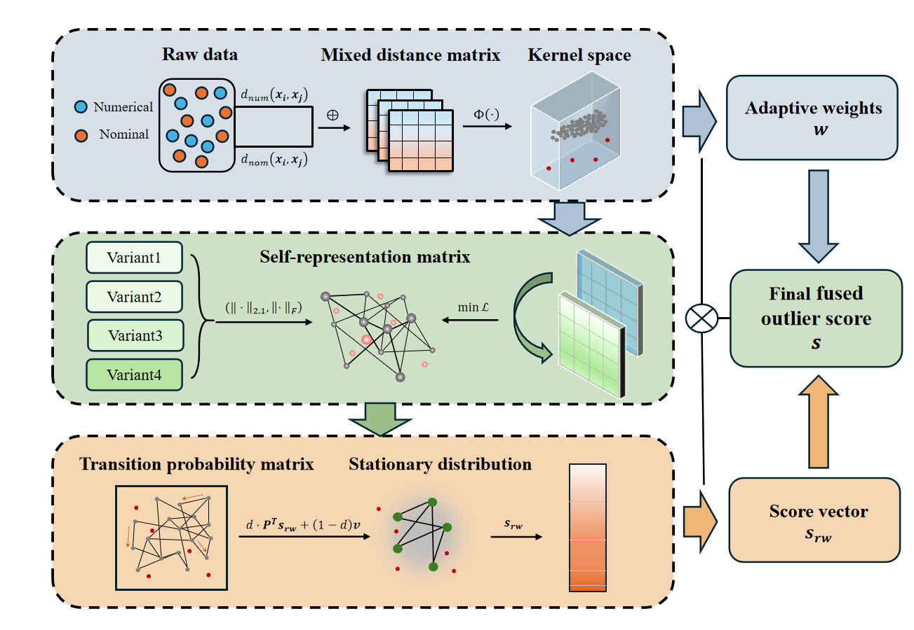

# KSRA

## Abstract
Anomaly detection is a pivotal technology in fields such as data mining, information security, and image processing. Existing research, however, faces two major challenges: 1) traditional proximity-based detection methods are susceptible to the distance concentration effect in high-dimensional spaces, leading to a decline in detection accuracy. 2) most models are only compatible with single-attribute data (either numerical or nominal), making them struggle with the mixed-type data prevalent in real-world scenarios, which limits their applicability. To address these challenges, this paper proposes a Kernelized Self-Representation based Anomaly detection (KSRA) method. Specifically, the original mixed data is first mapped into a high-dimensional feature space using a mixed kernel function. This process not only captures non-linear relationships, but also achieves a unified representation and feature enhancement for different attribute types, effectively mitigating the distance concentration problem. Building upon this, a generalized kernel self-representation framework is constructed. Four model variants are systematically derived based on different combinations of loss and regularization terms. Finally, a random walk mechanism is introduced to achieve efficient global information diffusion and deep integration, based on which a final anomaly score is defined to accurately reflect the anomaly degree of each sample. To verify the effectiveness of the proposed method, extensive comparative experiments are conducted on 20 benchmark datasets. The results demonstrate that the KSRA method  significantly outperforms 11 mainstream anomaly detection algorithms.

## Framework


## Usage
You can run KSRA by:
```
if __name__ == '__main__':

    lam = 0.01     # Set the regularization parameter for the self-learning representation

    data_name='Example_mixed.mat'
    mat = loadmat(r'Datasets\\' + data_name)
    trandata = mat['trandata'].astype(np.float64)

    labels = trandata[:, -1].ravel()  # label
    data = trandata[:, :-1]           # data

    scores = KSRA(data, lam)
    print(f"samples_scores = {scores}")

    auc = roc_auc_score(labels, scores)
    print(f"AUC = {auc:.10f}")
```
You can get outputs as follows:
```
samples_scores = [0.0734101  0.07207255 0.         0.18820704 0.08632531 0.06828188
 0.12850514 0.16674578 0.14261566 0.06776142 0.09791438 0.12213227
 0.03764677 0.04608058 0.00075949 0.13728534 0.04996738 0.0244497
 0.10961915 0.08438363]
AUC = 0.8125000000
```

## Contact
If you have any questions, please contact yangluoshu15717@foxmail.com or yuanzhong@scu.edu.cn.
